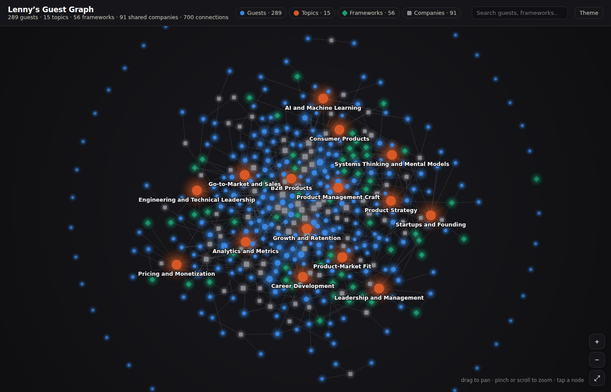

# Lenny's Guest Graph

What would Lenny's guests do? A knowledge graph of **289 Lenny's Podcast guests**, **15 broad topic areas**, **56 named frameworks**, and the **91 companies** that connect them — plus a Claude Code plugin that turns it into an interactive PM thought partner.



## The graph

Every guest, topic, framework, and shared company in the knowledge base, connected — 451 nodes, 798 edges. Every one of the 289 guests is linked: through the topics that cite them, the frameworks they coined, the companies they share — and, for guests none of those cover, topic edges inferred from their expertise tags.

- **Get feedback from the industry's finest:** bring `/lenny-graph` a brainstorm and it routes the problem through the graph — which experts should weigh in, which frameworks pressure-test it, and where those experts would disagree — then tees up a `/lenny-panel` debate
- **Explore it interactively:** open [`docs/index.html`](docs/index.html) locally, or enable GitHub Pages (Settings → Pages → Deploy from branch → `/docs`) to host it at `https://dakotaradigan.github.io/lennys-guest-graph/`
- **Regenerate it:** `python3 scripts/build_graph.py` rebuilds `knowledge/graph.json` (and the viz data) from the knowledge-base frontmatter, and lints for broken cross-links

(It handles direct lookups too — "which guests worked at Stripe?", "how are Shreyas Doshi and Annie Duke connected?" — but the routing is the point.)

Edges are derived entirely from the knowledge base itself: topics link to their key guests and frameworks, frameworks link to the guests who coined them, and guests link to the companies they've worked at.

## What is this?

A [Claude Code](https://claude.com/claude-code) plugin that acts as a Socratic thought partner for product managers. It draws on synthesized wisdom from 289 Lenny's Podcast guests and 56 named frameworks to help you think through hard product problems — not by giving you answers, but by asking better questions.

## Commands

| Command | What it does |
|---|---|
| `/lenny-setup` | Set your role, company stage, and how hard to push back (1-5) |
| `/lenny-wwld` | Think through a problem with a Socratic thought partner |
| `/lenny-ask-guest` | Get a specific guest's perspective (e.g., "What would Shreyas say?") |
| `/lenny-panel` | Assemble a panel of experts — see where they agree and disagree |
| `/lenny-feedback` | Get framework-grounded feedback on a PRD, strategy doc, or idea |
| `/lenny-frameworks` | Browse 56 named product frameworks by category |
| `/lenny-graph` | Bring a brainstorm — the graph finds the right experts, the frameworks to pressure-test it, and where the experts disagree |
| `/lenny-previous-chats` | Resume a saved conversation |

## Install

Inside Claude Code:

```
/plugin marketplace add dakotaradigan/lennys-guest-graph
/plugin install lenny-wisdom@lennys-guest-graph
```

Or try it from a local clone without installing:

```bash
git clone https://github.com/dakotaradigan/lennys-guest-graph.git
claude --plugin-dir ./lennys-guest-graph
```

> The plugin itself is named `lenny-wisdom` (your profile lives at `~/.claude/lenny-wisdom.local.md`), independent of the repository name. Installed commands are namespaced, e.g. `/lenny-wisdom:lenny-wwld`.

## Quick start

No setup required — just run any `/lenny-*` command:

```
/lenny-wwld How should I think about pricing for my AI product?
```

The plugin works with sensible defaults. Run `/lenny-setup` anytime to personalize.

## What's inside

### Knowledge base

- **289 guest profiles** — Synthesized frameworks, key ideas, and notable quotes from every Lenny's Podcast guest
- **15 broad topic areas** — Cross-guest synthesis on growth, strategy, PMF, pricing, leadership, and more
- **56 frameworks** — Named frameworks like North Star Metric, LNO, DHM Model, Adjacent User Theory, Superhuman PMF Engine, and more
- **Index files** — Guest and topic indexes for fast matching (the plugin never loads all files at once)
- **`knowledge/graph.json`** — The full node/edge graph, generated from the files above; guests carry `topics:` backlinks so every connection is navigable in both directions

### How it works

1. You describe a problem
2. The plugin reads the topic and guest indexes to find relevant expertise
3. It opens only the matched profiles and topic files
4. It asks you Socratic questions grounded in real frameworks and guest perspectives
5. You think better

### Challenge level

Set how much the plugin pushes back on your thinking:

| Level | Style |
|---|---|
| 1 | Exploratory — "Let's explore this together..." |
| 2 | Gentle probing — "Tell me more about..." |
| 3 | Warm but direct — "Have you considered...?" (default) |
| 4 | Significant pushback — "I want to challenge that assumption..." |
| 5 | Full challenge mode — "What evidence do you have for that?" |

### Saved conversations

After deeper conversations, the plugin offers to save your progress. Choose:

- **Global** (`~/.claude/lenny-wisdom/chats/`) — accessible from any directory
- **Local** (`.lenny/chats/`) — saved with your project

Resume anytime with `/lenny-previous-chats`.

## Sample guests

The knowledge base includes profiles for guests like:

| Guest | Known for |
|---|---|
| Shreyas Doshi | LNO Framework, Pre-mortems, PM productivity |
| Madhavan Ramanujam | Pricing strategy, Willingness to Pay |
| Gibson Biddle | DHM Model, Netflix product strategy |
| Elena Verna | Product-led growth, S-curve stacking |
| Marty Cagan | Empowered teams, product discovery |
| Sarah Tavel | Hierarchy of Engagement, marketplace strategy |
| Sean Ellis | Growth hacking, PMF test (40% rule) |
| April Dunford | Positioning framework |
| Nir Eyal | Hooked model, habit-forming products |
| Kim Scott | Radical Candor |

...and 279 more.

## Sample frameworks

| Framework | Source | Category |
|---|---|---|
| North Star Metric | Hila Qu | Growth |
| Racecar Growth Framework | Dan Hockenmaier | Growth |
| DHM Model | Gibson Biddle | Strategy |
| LNO Framework | Shreyas Doshi | Prioritization |
| Sean Ellis PMF Test | Sean Ellis / Rahul Vohra | Product-Market Fit |
| Superhuman PMF Engine | Rahul Vohra | Product-Market Fit |
| Radical Candor | Kim Scott | Leadership |
| Pre-mortem | Shreyas Doshi / Annie Duke | Decision-Making |
| One-Way vs Two-Way Doors | Amazon / multiple guests | Decision-Making |
| Willingness to Pay | Madhavan Ramanujam | Pricing |

...and 45 more across 10 categories.

## License

This plugin is MIT licensed. The synthesized knowledge base contains derivative insights from Lenny's Podcast and Newsletter, used in compliance with the [Lenny's Data license](https://github.com/LennysNewsletter/lennys-newsletterpodcastdata-all/blob/main/LICENSE.md) which permits derivative works shared publicly for free.

The plugin does not contain or redistribute raw podcast transcripts or newsletter content.
